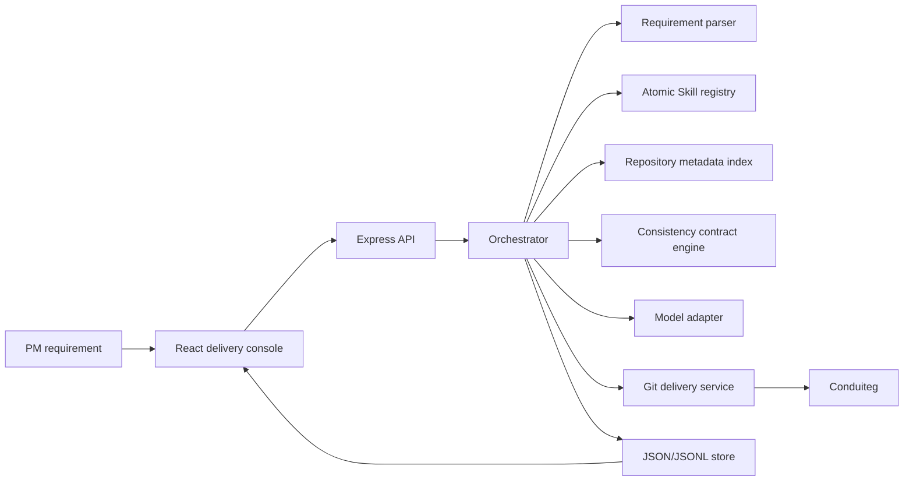

# Architecture

## Boundaries

- `src/shared/domain.ts`: shared API and UI contracts.
- `src/server/orchestrator`: stage flow, DSL parsing, Skill DAG planning, module location, and consistency contracts.
- `src/server/services`: model adapter, repository index, deterministic Article.coverImage patcher, Git delivery, and shell execution.
- `src/server/persistence`: local JSON state, JSONL events, and memory.
- `src/client`: delivery console.

## Extension Rule

New product requirements should first be represented as Requirement DSL intents,
then mapped to existing Atomic Skills. Add a recipe only when it captures repeated
planning experience. Add a new Skill only when existing Atomic Skills cannot
express the capability. Add a plugin-style runtime extension only when new tools
or execution surfaces are required.

## Real Model Path

The model adapter supports OpenAI-compatible `/chat/completions` endpoints. It is
used in two places:

- `parse-requirement-dsl`: converts PM text into DSL, questions, assumptions,
  contradictions, and acceptance criteria.
- `generate-unified-diff`: creates a patch for requirements that are not covered
  by deterministic fallback recipes.

Generated patches are treated as untrusted output. ORZ writes them to
`data/generated-patches`, runs `git apply --check`, then applies them only when
the patch is valid for the current Conduiteg checkout.
