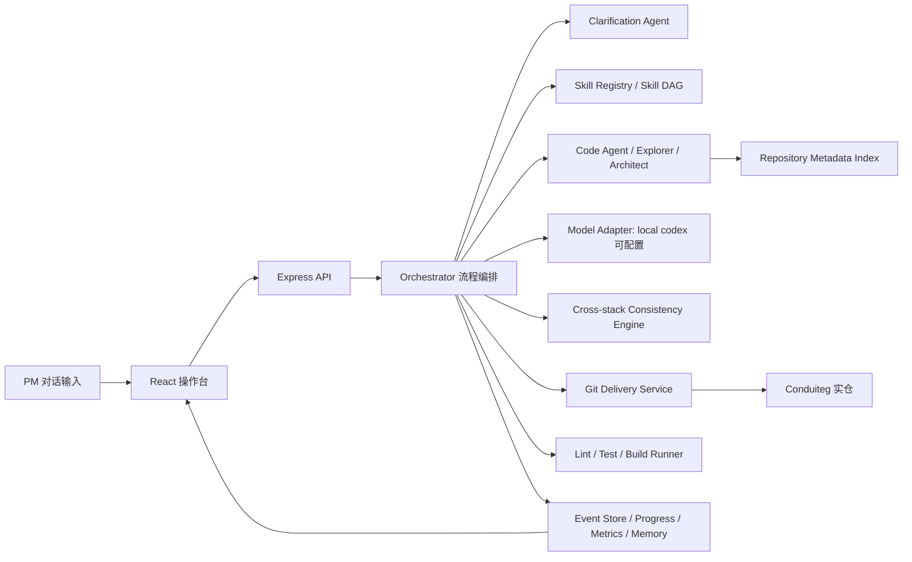

# L2/L3 超级个体设计方案

## 1. 目标定位

本项目实现一个可以端到端交付全栈项目的“超级个体”。主目标直接对齐 `L2 · 进阶（跨栈一致性）`，并内置 `L3 · 挑战` 能力。

系统需要让产品经理通过自然语言输入需求，并在平台内完成：

1. 需求澄清
2. 方案拆解
3. 模块定位
4. 代码生成
5. 写入 Conduit 实仓
6. Lint / 单测 / 构建验证
7. Git 提交与提测证据输出

涉及仓库：

- 系统主仓：`git@github.com:Beanoo/e2e.git`
- 操作目标仓：`git@github.com:Beanoo/Conduiteg.git`
- 本地系统路径：`/Users/doumengyao/work/e2e`
- 本地目标路径：`/Users/doumengyao/work/Conduiteg`

模型层使用通用的model-adapter，并保持可配置。

## 2. 设计原则

设计原则参考 Anthropic 的 long-running agent harness 方法论：

<https://www.anthropic.com/engineering/effective-harnesses-for-long-running-agents>

落地原则如下：

- 将长期状态放在模型上下文之外，例如 feature list、progress log、event store、Git commit。
- 区分 initializer 与 coding agent：initializer 负责初始化目标、约束、任务列表和进度记录；coding agent 每轮只推进一个可验证能力。
- 每个阶段都产生可恢复证据，避免上下文丢失后无法接续。
- 每轮变更都必须有明确验收标准、验证命令和 Git 状态。
- 用结构化 DSL、通用 Skill、模块定位和一致性合约约束模型输出，而不是依赖一段大 prompt。
- 新需求默认被拆解为多个通用 Skill 的有向执行图，而不是为每个需求新增一个专用 Skill。
- 优先使用可重复脚本和真实仓库状态，不使用与 Conduit 无关的 mock 仓库。

## 3. 总体架构



整体采用前端、后端、AI 编排三层真实实现：

- 前端：PM / Operator 操作台，展示需求、澄清、方案、模块、验证和交付证据。
- 后端：Express API，负责流程状态、仓库操作、模型调用、验证和事件持久化。
- AI 编排：Skill / Agent / Orchestrator 分层，负责需求结构化、代码理解、代码生成和重放。仓库事实索引作为 Code Agent 的工具存在，不作为独立智能 Agent。

## 4. 核心模块

### 4.1 Frontend Dashboard

前端是 PM 和操作员的统一工作台，需要展示：

- 产品需求输入框
- 澄清问题与回答
- Requirement DSL
- 命中的 Skill
- 受影响模块和文件
- 跨栈一致性合约
- 阶段状态与断点重放入口
- 验证结果
- Git 分支、变更文件、commit hash
- 模型调用指标
- 历史交付记忆召回结果

前端不只是聊天窗口，而是一个交付控制台。每个关键阶段都应该能被人工确认、修改和继续执行。

### 4.2 Backend API

后端负责流程编排和状态流转。

计划接口：

- `GET /api/project`：读取项目状态、feature list、progress log 和 quality gates。
- `GET /api/repository`：读取目标仓库状态。
- `POST /api/deliveries`：根据 PM 输入创建交付会话。
- `GET /api/deliveries/:id`：读取某次交付会话。
- `POST /api/deliveries/:id/approve`：确认人工门禁。
- `POST /api/deliveries/:id/replay`：从指定阶段重放下游流程。
- `GET /api/skills`：查看已注册 Skill。
- `GET /api/metrics`：查看模型调用 tokens、延迟、成本和成功率。

### 4.3 Orchestrator

Orchestrator 的阶段固定，Skill 行为可插拔。

阶段如下：

1. `clarify`：识别歧义、矛盾、缺失验收标准，并生成澄清问题。
2. `plan`：将需求转换为可执行 DSL 和交付方案。
3. `locate`：定位目标文件和模块边界。
4. `generate`：调用可配置模型生成计划或 patch。
5. `apply`：将变更写入 `Conduiteg`。
6. `verify`：运行 lint、单测、构建和可选 smoke check。
7. `commit`：生成可追踪 Git commit。
8. `memory`：沉淀可复用决策和交付证据。

每个阶段都必须写入事件日志，支持暂停、人工编辑和从任意下游阶段重放。

### 4.4 Skill Registry / Skill DAG

这里需要避免“一需求一 Skill”的错误抽象。理想形态不是为每个产品需求生成一个专用 Skill，而是把新需求拆解成多个可复用的原子能力 Skill，再由 Orchestrator 组合成一个执行 DAG。

参考 `/Users/doumengyao/work/opencode` 中的两个设计方向：

- `claude-code/plugins/feature-dev`：一个 feature-dev 工作流组合 `code-explorer`、`code-architect`、`code-reviewer` 等通用 agent，而不是为每个 feature 写一个 agent。
- `openclaw/VISION.md` 和插件架构：core 保持瘦，能力通过插件、manifest、capability 和轻量 metadata 扩展；新能力优先放在扩展边界，而不是把主干变成需求模板集合。

因此本项目的 Skill 分三层：

1. **Atomic Skill**：原子能力，例如澄清、模块定位、字段传播、API 契约更新、前端表单更新、测试生成、验证执行。
2. **Recipe / Pattern**：可选的领域组合模板，例如“文章新增字段”可以预设一组原子 Skill 顺序，但它不是必须新增的能力边界。
3. **Plugin / Extension**：当需求需要新的运行时能力、工具、仓库事实提取器或验证器时，才通过插件式扩展接入。

新增需求的默认路径：

1. Requirement Parser 将 PM 输入拆成多个变更意图，例如 `add-field`、`persist-data`、`expose-api`、`edit-form`、`render-view`、`test-contract`。
2. Capability Planner 根据变更意图选择一组通用 Atomic Skill。
3. Orchestrator 将这些 Skill 编排成 DAG，并显式表达依赖关系。
4. 如果已有 Recipe 命中，例如“Article 字段扩展”，则用 Recipe 加速规划；未命中时仍可通过 Atomic Skill 完成。
5. 只有当现有 Atomic Skill 无法表达某类能力时，才新增 Skill；只有当需要新工具或运行时扩展时，才新增 Plugin。

一个 Atomic Skill 文件应包含：

- `id`
- `name`
- `level`
- `capability`
- `inputContract`
- `outputContract`
- `preconditions`
- `postconditions`
- `ownedStacks`
- `clarificationQuestions`
- `contextRequirements`
- `generationPromptTemplate`
- `verificationCommands`
- `failureModes`

初始 Atomic Skills：

- `clarify-requirement`：识别歧义、矛盾、角色、边界和验收缺口。
- `map-codebase-context`：根据 DSL 和仓库索引定位相关文件。
- `add-data-field`：为持久化模型增加字段、默认值和迁移策略。
- `update-api-contract`：更新请求参数、响应序列化和错误处理。
- `update-frontend-form`：更新表单状态、校验、提交载荷和编辑回填。
- `update-frontend-rendering`：更新列表、详情、空态和兼容展示。
- `generate-contract-tests`：生成或更新跨栈契约测试。
- `run-verification`：执行目标仓验证命令并结构化结果。
- `review-change`：检查跨栈一致性、风险、回归和缺失测试。

可选 Recipes：

- `recipe.article-field-extension`：文章字段扩展，由 `add-data-field -> update-api-contract -> update-frontend-form -> update-frontend-rendering -> generate-contract-tests` 组成。
- `recipe.idempotent-interaction`：幂等交互，由 `add-data-field / add-relation -> update-api-contract -> update-frontend-rendering -> generate-contract-tests` 组成。
- `recipe.lifecycle-state`：状态流转类需求，由 `add-data-field -> update-api-contract -> update-frontend-form -> update-frontend-rendering -> run-verification` 组成。

Recipe 的作用是复用规划经验，不是新增需求的唯一入口。

### 4.5 Repository Metadata Index

Repository Metadata Index 不是独立智能 Agent，而是 Code Agent 使用的确定性仓库事实服务。它的职责是把低成本、可缓存、可重复计算的仓库事实提供给 Code Explorer / Code Architect，减少每次从零 `rg/read` 的成本，并降低跨栈改动漏文件的风险。

它只做事实索引，不做需求理解、架构决策、代码生成或最终模块边界判断。最终模块边界仍由 Code Agent 基于索引结果和实际源码阅读确定。

需要维护的仓库事实：

- 文件树和重要目录
- package scripts 和验证命令
- Sequelize models
- migrations
- Express routes
- controllers
- frontend services
- React routes / components
- tests
- README 和工程约定
- 最近交付记录

推荐边界：

- `Repository Metadata Index`：提供确定性事实，例如路由、模型、控制器、服务、组件、测试和脚本映射。
- `Code Explorer Agent`：基于事实索引做深度语义阅读，输出关键文件、调用链和现有模式。
- `Code Architect Agent`：基于 Explorer 结果和需求 DSL 设计实现方案。
- `Code Agent`：执行代码生成、编辑和修复。

上下文选择由 `Requirement DSL + Skill DAG + Repository Metadata Index + Code Explorer 阅读结果` 共同决定。

### 4.6 Cross-stack Consistency Engine

这是 L2 的核心能力。系统需要为每个跨栈需求生成一致性合约，并验证源字段是否传播到所有声明位置。

以 `Article.coverImage` 为例：

- 源头字段：`backend/models/Article.js`
- 数据迁移：`backend/migrations/20220129140808-create-article.js`
- 后端 API：`backend/controllers/articles.js`
- 前端请求载荷：`frontend/src/services/setArticle.js`
- 前端输入：`frontend/src/routes/ArticleEditor.jsx`
- 前端展示：文章列表和文章详情页
- 测试：后端字段序列化、前端渲染或辅助逻辑

验证阶段如果发现某个传播目标缺失，应直接判定该交付未通过。

### 4.7 Model Adapter

模型层默认调用本地 Codex，并通过环境变量配置：

```bash
CODEX_COMMAND=codex
CODEX_MODEL=local-codex
CODEX_MODEL_ENABLED=1
CODEX_MODEL_TIMEOUT_MS=120000
```

每次模型调用记录：

- provider
- model
- purpose
- latency
- input tokens
- output tokens
- estimated cost
- status
- createdAt

后续可增加 Doubao、OpenAI、Anthropic 或开源模型 adapter，但 Orchestrator 不直接绑定具体模型。

### 4.8 Git Delivery Service

Git 服务真实操作 `/Users/doumengyao/work/Conduiteg`。

职责：

- 确认 remote 是 `git@github.com:Beanoo/Conduiteg.git`。
- 目标仓工作区不安全时拒绝继续。
- 为每条需求创建独立分支，例如 `e2e/D-yyyymmddhhmmss-title`。
- 在 `docs/e2e-deliveries/` 写入交付证据。
- 应用生成的代码变更。
- 运行验证命令。
- 生成带元数据的 Git commit。
- 返回分支、变更文件、commit hash 和验证证据。

## 5. 共享领域模型

共享 TypeScript domain 是前后端一致性的系统源头。

核心 schema 放在 `src/shared/domain.ts`：

- `RequirementDsl`
- `ClarificationQuestion`
- `SkillManifest`
- `ModuleTarget`
- `ConsistencyContract`
- `DeliverySession`
- `DeliveryStageEvent`
- `VerificationResult`
- `AiCallMetric`
- `MemoryRecord`

这些结构应同时被 API、前端和测试消费，系统自身也要遵守跨栈一致性。

## 6. L2 示例链路：文章封面图

PM 输入：

> 文章支持封面图，新建/编辑文章时可以填 URL，列表和详情页展示。

预期流程：

1. Requirement Parser 将需求拆成：
   - `add-field`: `Article.coverImage`
   - `persist-data`: Sequelize model / migration
   - `expose-api`: article create / update / read API
   - `edit-form`: 新建 / 编辑文章表单
   - `render-view`: 列表和详情展示
   - `test-contract`: 字段传播和兼容性验证
2. Capability Planner 选择 Atomic Skill DAG：
   - `clarify-requirement`
   - `map-codebase-context`
   - `add-data-field`
   - `update-api-contract`
   - `update-frontend-form`
   - `update-frontend-rendering`
   - `generate-contract-tests`
   - `run-verification`
   - `review-change`
3. 如果命中 `recipe.article-field-extension`，则用它作为初始编排模板；如果未命中，也可以由通用 Atomic Skill 组合完成。
4. 主动澄清：
   - 旧文章没有封面图时是否隐藏图片区域？
   - URL 是只做字符串保存，还是需要校验图片格式？
5. 生成 Requirement DSL。
6. 定位模块：
   - `backend/models/Article.js`
   - `backend/migrations/20220129140808-create-article.js`
   - `backend/controllers/articles.js`
   - `frontend/src/services/setArticle.js`
   - `frontend/src/routes/ArticleEditor.jsx`
   - 文章列表与详情组件
7. 生成跨栈一致性合约。
8. 调用本地 Codex 生成实现计划或 patch。
9. 应用 patch 到 `Conduiteg`。
10. 运行目标仓验证。
11. 提交 delivery 分支。
12. 将本次文章字段类需求的 Skill DAG、关键决策和验证结果沉淀为历史记忆。

## 7. L3 能力设计

### 7.1 主动澄清

如果 PM 输入缺少角色、数据来源、展示规则、兼容行为或验收标准，流程停在 `clarify`，不直接生成代码。

### 7.2 多模块协同拆解

系统必须先展示受影响模块，再进入文件编辑。操作员可以修改模块边界，并从 `generate` 阶段重放。

### 7.3 反模式识别

矛盾需求标记为 `contradictory`。例如“匿名用户必须幂等点赞评论，同时禁止任何持久身份”，系统需要指出冲突，并给出可执行替代方案。

### 7.4 断点重放

操作员可以修改 DSL、Skill DAG、Recipe 命中结果、模块目标或测试计划，然后从 `plan`、`locate`、`generate` 或 `verify` 重放下游。

### 7.5 业务上下文反哺

每次成功交付沉淀：

- requirement fingerprint
- selected Skill DAG / Recipe
- DSL 摘要
- 关键决策
- 变更文件
- 验证结果
- commit hash

后续相似需求先召回历史决策，再进入规划。

### 7.6 可观测性

每次 AI 调用展示：

- 调用目的
- 模型
- 延迟
- tokens
- 估算成本
- 状态
- 创建时间

## 8. 数据持久化

第一阶段采用本地 JSON 文件，降低复杂度并便于答辩展示。

建议数据文件：

- `data/runtime.json`：项目运行态、quality gates 和 progress log。
- `data/deliveries/*.json`：每次交付会话。
- `data/events/*.jsonl`：事件溯源日志。
- `data/memory/*.json`：历史需求记忆。
- `data/metrics/*.jsonl`：模型调用指标。

后续可以迁移到 SQLite，但 API 合约不变。

## 9. 实施计划

1. 固化 shared domain：补齐 DSL、Skill、DeliverySession、metrics、memory 等 schema。
2. 将 `skills.ts` 改造成 Atomic Skill 注册表和 Capability Planner，让 `/api/deliveries` 返回完整 L2/L3 结构。
3. 增加持久化事件存储，先用 JSON 文件实现。
4. 扩展前端交付详情页，展示 DSL、Skill DAG、Recipe 命中、模块定位、一致性合约、模型指标和阶段状态。
5. 实现 replay API，支持从指定阶段重放。
6. 接入可配置本地 Codex adapter，用于方案和 patch 生成。
7. 完成第一条真实 L2 交付链路：`Article.coverImage`，但实现方式必须复用通用 Atomic Skill 组合，而不是新增一个专用需求 Skill。
8. 在 `Conduiteg` 实仓跑通一次：分支、代码变更、验证、commit。
9. 补充 README、架构图、演示脚本、AI 使用说明和工程难点说明。

## 10. 验收标准

- 系统具备真实前端、后端和 AI 编排层。
- PM 输入可以创建针对 `Conduiteg` 的可追踪交付会话。
- L2 跨栈一致性以机器可读合约表达。
- 至少一条 L2 需求能通过通用 Atomic Skill DAG 跑通真实代码交付路径。
- 新需求优先复用 Atomic Skill 和 Recipe；只有出现新的不可表达能力时才新增 Skill。
- L3 的歧义识别、矛盾识别和主动澄清能力明确存在。
- 每个阶段可以暂停、人工修改并重放下游。
- 模型调用可观测。
- 历史交付记忆可以被后续相似需求复用。
- 验证使用真实命令并记录证据。
- 最终产出 Git 分支、commit、变更文件、验证结果和交付文档。
